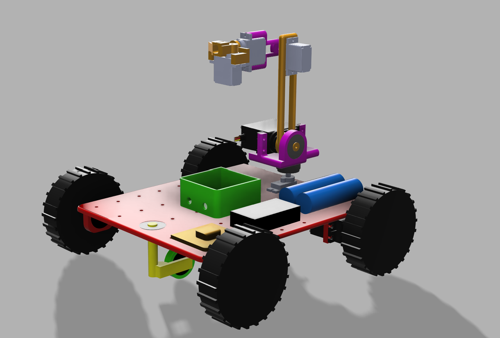
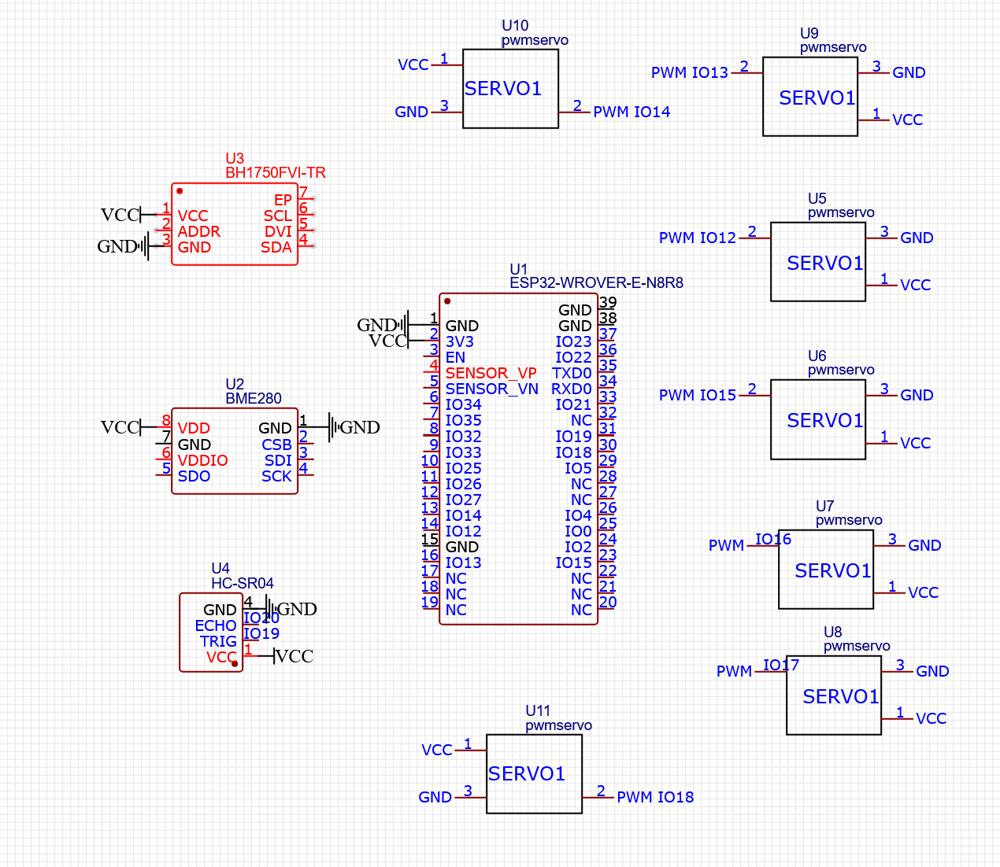
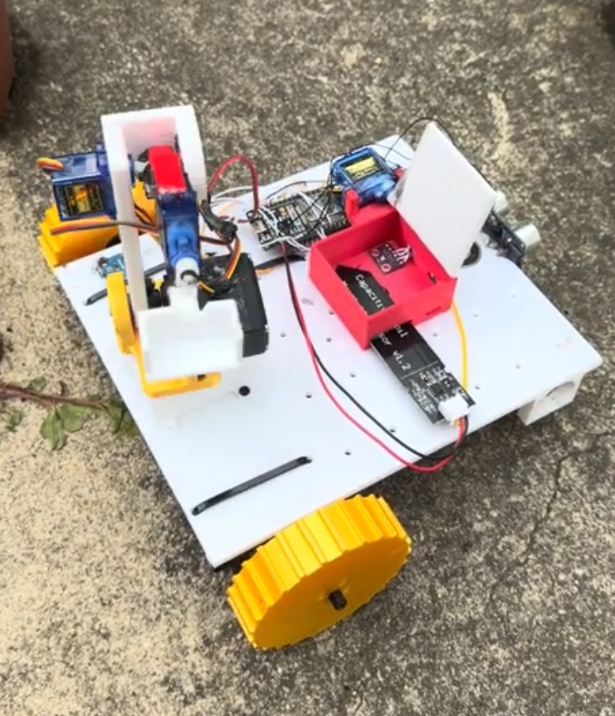

# ESP32 Plant Health Monitor Rover

A self-driving ESP32-based soil sampling rover consisting of a tank-drive chassis, a multi-servo soil collector arm, and a small environmental sensors suite. Upon powering on, the rover will run its complete soil sampling routine, do a randomized drive sequence, stop, and idle.

I built this to sample soil health from my garden and this is just a prototype, not the real version yet, I will build another iteration but this is what I have currently.

## Features

* Autonomous start-up and work
* Two-servo tank drive
* Seven servos total

  * Two continuous-rotation drive servos
  * Four arm position servos
  * One sample chamber closing servo
* Smooth servo movement
* Simultaneous two-servos action
* Shovel shaking to dump collected soil
* Random forward, turning, and curved driving segments
* Autonomous drive stop after the sequence execution
* Soil electrical conductivity measurement
* Temperature, humidity, pressure, and light measurements support
* Front ultrasound distance measurement
* 2S 18650 battery-based power supply with a step-down converter
* No extra Python packages required for the core autonomous work

## Proof Pictures

Here is the demo video I have on the robot:

https://www.youtube.com/shorts/W9_TdJyh92A

### CAD Prototype



The CAD prototype shows the planned rover structure, including the tank-drive chassis and the soil collection mechanism layout.

### Circuit Schematic



The circuit schematic shows how the ESP32 connects to the drivetrain, servo arm system, sensors, and power system.

### Real-Life Prototype



The real-life prototype shows the current physical version of the rover built for testing garden soil sampling, sensor integration, and servo-controlled soil collection.

## Hardware Description

The rover utilizes ESP32 microcontroller. Tank drive is controlled using two PWM outputs, acting as continuous-rotation servos. Soil collection uses five additional PWM outputs to actuate servos of the arm and close the sample chamber.

Sensors include a BH1750 light sensor, a BME280 environmental sensor, an HC-SR04 ultrasound distance sensor, and an analog soil electrical conductivity sensor. Both BH1750 and BME280 are on the same I2C bus.

## GPIO Mapping

| Component             | Purpose                                    | ESP32 GPIO |
| --------------------- | ------------------------------------------ | ---------: |
| Left drive motor      | Drivetrain                                 |         14 |
| Right drive motor     | Drivetrain                                 |         12 |
| Base yaw motor        | Collection arm rotation                    |         13 |
| Base pitch motor      | Main collection arm lift                   |         15 |
| Second pitch motor    | Secondary collection arm                   |         26 |
| Shovel rotation motor | Soil collector/collector                   |          4 |
| Sample chamber motor  | Opens/closes sample chamber                |         25 |
| Soil EC sensor        | Analog soil electrical conductivity sensor |         39 |
| BH1750                | I2C SDA                                    |         21 |
| BH1750                | I2C SCL                                    |         22 |
| BME280                | I2C SDA                                    |         21 |
| BME280                | I2C SCL                                    |         22 |
| HC-SR04 ultrasonic    | Trigger                                    |         16 |
| HC-SR04 ultrasonic    | Echo                                       |         17 |

### BH1750 Light Sensor

BH1750 detects the ambient light level. Sensor is wired via I2C bus, which is shared with BME280.

| Pin | Connection |
| --- | ---------- |
| VCC | 3.3 V      |
| GND | GND        |
| SDA | GPIO21     |
| SCL | GPIO22     |

### BME280 Environmental Sensor

BME280 measures temperature, humidity, and air pressure. It is also wired via I2C bus, shared with BME280.

| Pin | Connection |
| --- | ---------- |
| VCC | 3.3 V      |
| GND | GND        |
| SDA | GPIO21     |
| SCL | GPIO22     |

### HC-SR04 Ultrasonic Sensor

HC-SR04 is used as a front distance sensor for obstacle detection.

| Pin     | Connection   |
| ------- | ------------ |
| VCC     | 3.3 V        |
| GND     | GND          |
| Trigger | GPIO16 / RX2 |
| Echo    | GPIO17 / TX2 |

### Analog Soil EC Sensor

Soil Electrical Conductivity sensor is connected to VN/GPIO39 of the ESP32.

| Pin        | Connection  |
| ---------- | ----------- |
| VCC        | 3.3 V       |
| GND        | GND         |
| Analog out | GPIO39 / VN |

## Servos

Seven servos in rover.

| Servo            | Function                               | ESP32 GPIO |
| ---------------- | -------------------------------------- | ---------: |
| Left drivetrain  | Left drive motor for tank driving      |         14 |
| Right drivetrain | Right drive motor for tank driving     |         12 |
| Yaw              | Collection arm rotation                |         13 |
| Pitch base       | Collection arm lifting                 |         15 |
| Pitch secondary  | Collection arm second joint            |         26 |
| Shovel rotation  | Soil collector arm rotation            |          4 |
| Chamber          | Open/closes the soil collector chamber |         25 |

## Power System

The rover is powered from a 2S 18650 battery pack. 2S lithium-ion battery pack provides about 7.4V nominally and 8.4V at full charge. This voltage level is too much for standard 5V servos and ESP32 GPIO pins, so the rover uses an XL4005 buck converter to step-down the voltage.

```text
2S 18650 battery pack
        |
        |
      Switch
        |
        |
   XL4005 buck converter
        |
        |
   Regulated 5 V rail
        |
        |---- Servo power rail
        |---- ESP32 5 V/VIN input, if used regulated 5 V
        |---- Sensor power, if the sensor requires 5 V
```

## Soil Sampling Movement Sequence

| Step | Action                                            |
| ---: | ------------------------------------------------- |
|    1 | Base yaw to 500 µs                                |
|    2 | Second pitch to 1050 µs                           |
|    3 | Base pitch to 520 µs                              |
|    4 | Shovel rotation to 500 µs                         |
|    5 | Second pitch to 2330 µs                           |
|    6 | Shovel rotation to 2500 µs                        |
|    7 | Second pitch to 1080 µs                           |
|    8 | Chamber seal to 1000 µs                           |
|    9 | Base pitch to 1600 µs and second pitch to 2000 µs |
|   10 | Base yaw to 2500 µs                               |
|   11 | Base pitch to 1000 µs                             |
|   12 | Shovel rotation to 550 µs                         |
|   13 | Jittering shovel between 500 and 750 µs           |
|   14 | Base pitch to 1600 µs and chamber seal to 2180 µs |

## Repository Structure

* `Code/main.py` - compact autonomous MicroPython firmware
* `README.md` - project overview and instructions for setup
* `CAD` - CAD step files for building it yourself
* `Pictures` - All pictures of schematic/prototype/cad
