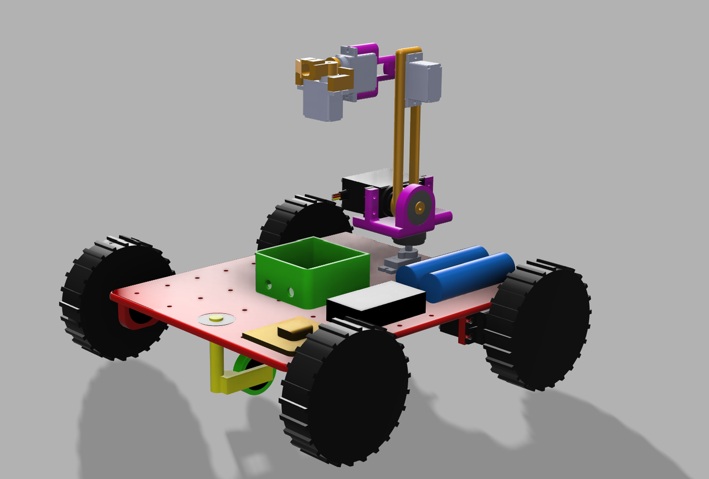
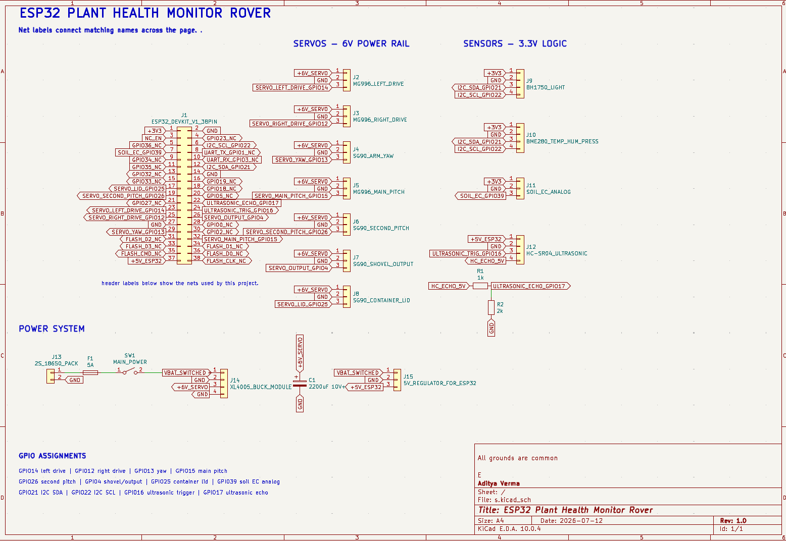
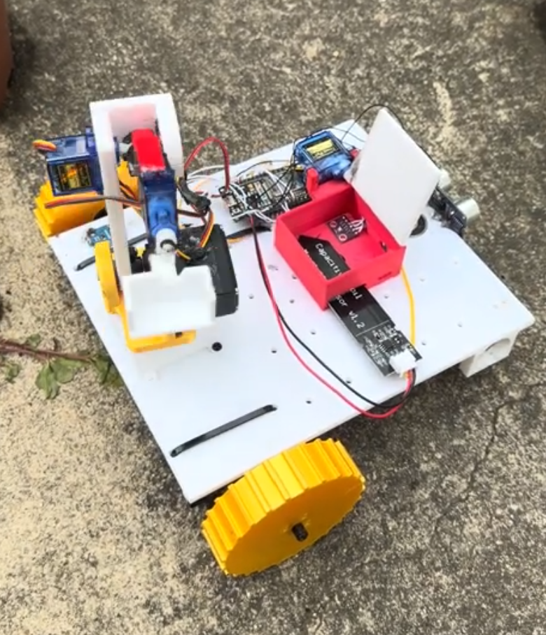

# ESP32 Plant Health Monitor Rover

I built this to sample soil health from my garden and this is just a prototype, not the real version yet, I will build another iteration but this is what I have currently. It is a fun educational toy to play with though.

## Features

* Autonomous
* Two-servo tank drive
* Seven servos total
  * Two continuous-rotation drive servos
  * Four arm position servos
  * One sample chamber closing servo
* Soil electrical conductivity measurement
* Temperature, humidity, pressure, and light measurements
* Ultrasound distance measurement

## Proof Pictures

Here is the demo video I have on the robot:

https://www.youtube.com/shorts/W9_TdJyh92A

### CAD Prototype

### Circuit Schematic

### Real-Life Prototype

## Hardware Description

The rover utilizes ESP32 microcontroller. Tank drive is controlled using two PWM outputs, acting as continuous-rotation servos. Soil collection uses five additional PWM outputs to actuate servos of the arm and close the sample chamber.

Sensors include a BH1750 light sensor, a BME280 environmental sensor, an HC-SR04 ultrasound distance sensor, and an analog soil electrical conductivity sensor. Both BH1750 and BME280 are on the same I2C bus.

## Bill of materials

| Category | Quantity | Part | Link | Price |
|---|---:|---|---|---:|
| Electronics | 1 | ESP32 development board | [AliExpress](https://www.aliexpress.us/item/3256812360578716.html) | $4.67 |
| Actuator | 2 | Continuous-rotation drivetrain servo | [AliExpress](https://www.aliexpress.us/item/3256804365417662.html) | $9.28 (2-pack) |
| Actuator | 1 | Main arm pitch servo | [AliExpress](https://www.aliexpress.us/item/3256804365417662.html) | $4.64 used (1 of 2-pack at $9.28) |
| Actuator | 5 | Micro servo | [AliExpress](https://www.aliexpress.us/item/3256806107378152.html) | $4.95 used (5 at $0.99 each) |
| Sensor | 1 | Ambient light sensor | [AliExpress](https://www.aliexpress.us/item/3256809513329235.html) | $3.00 |
| Sensor | 1 | Environmental sensor | [AliExpress](https://www.aliexpress.us/item/3256812547404758.html) | $5.85 |
| Sensor | 1 | Ultrasonic distance sensor | [AliExpress](https://www.aliexpress.us/item/3256810017345486.html) | $1.25 |
| Sensor | 1 | Soil electrical conductivity sensor | [AliExpress](https://www.aliexpress.us/item/3256811685769454.html) | $13.29 |
| Power | 1 | Buck converter | [AliExpress](https://www.aliexpress.us/item/3256806558389509.html) | $1.46 |
| Power | 2 | Lithium-ion cell | [AliExpress](https://www.aliexpress.us/item/3256811867524654.html) | $3.35 used (2 of 16-pack at $26.77) |
| Power | 1 | 2S battery holder | [AliExpress](https://www.aliexpress.us/item/3256809135366720.html) | $0.99 |
| Power | 1 | Power switch | [AliExpress](https://www.aliexpress.us/item/3256807619399290.html) | $0.16 used (1 of 10-pack at $1.64) |
| Power | 1 | 2S battery charger | [AliExpress](https://www.aliexpress.us/item/3256805668198456.html) | $0.99 |
| Protection | 1 | Ultrasonic echo level shifter | [AliExpress](https://www.aliexpress.us/item/3256810490396292.html) | $0.24 used (1 of 5-pack at $1.19) |
| Mechanical | 5 | Ball bearing | [AliExpress](https://www.aliexpress.us/item/3256805609422387.html) | $8.06 (5-pack) |
| Mechanical | As needed | M3 fasteners | [AliExpress](https://www.aliexpress.us/item/3256809672273859.html) | $14.88 assortment kit |
| Mechanical | Included with servos | Servo horns and screws | [AliExpress](https://www.aliexpress.us/item/3256804365417662.html) | $0.00 (included with servos) |
| Fabricated | 1 | Base structure | [PLA filament](https://www.aliexpress.us/item/3256806989098121.html) | $1.75 estimated (173 g solid PLA) |
| Fabricated | 2 | Drivetrain wheel | [PLA filament](https://www.aliexpress.us/item/3256806989098121.html) | $2.12 estimated (209 g solid PLA) |
| Fabricated | 1 | Front caster wheel | [PLA filament](https://www.aliexpress.us/item/3256806989098121.html) | $0.02 estimated (2.4 g solid PLA) |
| Fabricated | 1 | Front wheel hinge | [PLA filament](https://www.aliexpress.us/item/3256806989098121.html) | $0.06 estimated (5.8 g solid PLA) |
| Fabricated | 1 | Arm yaw servo holder | [PLA filament](https://www.aliexpress.us/item/3256806989098121.html) | $0.27 estimated (26.2 g solid PLA) |
| Fabricated | 1 | Arm yaw horn attachment | [PLA filament](https://www.aliexpress.us/item/3256806989098121.html) | $0.03 estimated (2.5 g solid PLA) |
| Fabricated | 1 | Arm pitch servo holder | [PLA filament](https://www.aliexpress.us/item/3256806989098121.html) | $0.18 estimated (17.8 g solid PLA) |
| Fabricated | 1 | Arm pitch horn attachment | [PLA filament](https://www.aliexpress.us/item/3256806989098121.html) | $0.17 estimated (16.8 g solid PLA) |
| Fabricated | 1 | Arm pitch adapter | [PLA filament](https://www.aliexpress.us/item/3256806989098121.html) | $0.03 estimated (2.9 g solid PLA) |
| Fabricated | 1 | Main arm | [PLA filament](https://www.aliexpress.us/item/3256806989098121.html) | $0.01 estimated (1.3 g solid PLA) |
| Fabricated | 1 | Second-pitch horn attachment | [PLA filament](https://www.aliexpress.us/item/3256806989098121.html) | $0.07 estimated (6.9 g solid PLA) |
| Fabricated | 1 set | General output attachment | [PLA filament](https://www.aliexpress.us/item/3256806989098121.html) | $0.05 estimated (5.0 g solid PLA) |
| Fabricated | 1 | Shovel output attachment | [PLA filament](https://www.aliexpress.us/item/3256806989098121.html) | $0.02 estimated (2.2 g solid PLA) |
| Fabricated | 1 | Soil container | [PLA filament](https://www.aliexpress.us/item/3256806989098121.html) | $0.20 estimated (19.5 g solid PLA) |
| Fabricated | 1 | Soil container lid | [PLA filament](https://www.aliexpress.us/item/3256806989098121.html) | $0.05 estimated (5.3 g solid PLA) |
| Consumable | As needed | Hookup wire | [AliExpress](https://www.aliexpress.us/item/3256808061834409.html) | $4.69 allowance |
| Consumable | As needed | Assembly consumables | [AliExpress](https://www.aliexpress.us/item/3256805494059216.html) | $3.30 allowance |

## GPIO Mapping (needed for final wiring)

| Component             | Purpose                                    | ESP32 GPIO |
| --------------------- | ------------------------------------------ | ---------: |
| Left drive motor      | Drivetrain                                 |         14 |
| Right drive motor     | Drivetrain                                 |         12 |
| Base yaw motor        | Collection arm rotation                    |         13 |
| Base pitch motor      | Main collection arm lift                   |         15 |
| Second pitch motor    | Secondary collection arm                   |         26 |
| Shovel rotation motor | Soil collector/collector                   |          4 |
| Sample chamber motor  | Opens/closes sample chamber                |         25 |
| Soil EC sensor        | Analog soil electrical conductivity sensor |         39 |
| BH1750                | I2C SDA                                    |         21 |
| BH1750                | I2C SCL                                    |         22 |
| BME280                | I2C SDA                                    |         21 |
| BME280                | I2C SCL                                    |         22 |
| HC-SR04 ultrasonic    | Trigger                                    |         16 |
| HC-SR04 ultrasonic    | Echo                                       |         17 |

### BH1750 Light Sensor

Wired through I2C

| Pin | Connection |
| --- | ---------- |
| VCC | 3.3 V      |
| GND | GND        |
| SDA | GPIO21     |
| SCL | GPIO22     |

### BME280 Temp/Humidity/Air Pressure Sensor

Wired through I2C

| Pin | Connection |
| --- | ---------- |
| VCC | 3.3 V      |
| GND | GND        |
| SDA | GPIO21     |
| SCL | GPIO22     |

### HC-SR04 Ultrasonic Sensor

Distance sensor for navigation

| Pin     | Connection   |
| ------- | ------------ |
| VCC     | 3.3 V        |
| GND     | GND          |
| Trigger | GPIO16 / RX2 |
| Echo    | GPIO17 / TX2 |

### Analog Soil EC Sensor

Analog 

| Pin        | Connection  |
| ---------- | ----------- |
| VCC        | 3.3 V       |
| GND        | GND         |
| Analog out | GPIO39 / VN |

## Servos

Seven servos in rover.

| Servo            | Function                               | ESP32 GPIO |
| ---------------- | -------------------------------------- | ---------: |
| Left drivetrain  | Left drive motor for tank driving      |         14 |
| Right drivetrain | Right drive motor for tank driving     |         12 |
| Yaw              | Collection arm rotation                |         13 |
| Pitch base       | Collection arm lifting                 |         15 |
| Pitch secondary  | Collection arm second joint            |         26 |
| Shovel rotation  | Soil collector arm rotation            |          4 |
| Chamber          | Open/closes the soil collector chamber |         25 |

## Soil Sampling Movement Sequence

| Step | Action                                            |
| ---: | ------------------------------------------------- |
|    1 | Base yaw to 500 µs                                |
|    2 | Second pitch to 1050 µs                           |
|    3 | Base pitch to 520 µs                              |
|    4 | Shovel rotation to 500 µs                         |
|    5 | Second pitch to 2330 µs                           |
|    6 | Shovel rotation to 2500 µs                        |
|    7 | Second pitch to 1080 µs                           |
|    8 | Chamber seal to 1000 µs                           |
|    9 | Base pitch to 1600 µs and second pitch to 2000 µs |
|   10 | Base yaw to 2500 µs                               |
|   11 | Base pitch to 1000 µs                             |
|   12 | Shovel rotation to 550 µs                         |
|   13 | Jittering shovel between 500 and 750 µs           |
|   14 | Base pitch to 1600 µs and chamber seal to 2180 µs |

## Assembly Instructions

### Parts and Tools

Print all of the parts in [`SOURCE CAD/Individual Parts`](SOURCE%20CAD/Individual%20Parts).

### 1. Print and Prepare the Parts

1. Print and refine every part

### 2. Assemble the Base and Drivetrain

1. Begin with [`base_structure.stl`](SOURCE%20CAD/Individual%20Parts/base_structure.stl), the large base.
2. Install [`front_wheel_hinge.stl`](SOURCE%20CAD/Individual%20Parts/front_wheel_hinge.stl), then fit a 608 bearing and [`front_caster_wheel.stl`](SOURCE%20CAD/Individual%20Parts/front_caster_wheel.stl) into the caster.

### 3. Build the Arm Yaw and Main Pitch Axes

1. Attach [`arm_yaw_servo_horn_attachment.stl`](SOURCE%20CAD/Individual%20Parts/arm_yaw_servo_horn_attachment.stl) to the centered SG90 horn. use 608 on opposite side of the axis.
2. Secure [`arm_yaw_servo_holder.stl`](SOURCE%20CAD/Individual%20Parts/arm_yaw_servo_holder.stl) with M3s.
3. Fit [`arm_pitch_adapter.stl`](SOURCE%20CAD/Individual%20Parts/arm_pitch_adapter.stl)
4. Install the MG996 in [`arm_pitch_servo_holder.stl`](SOURCE%20CAD/Individual%20Parts/arm_pitch_servo_holder.stl) 

### 4. Add the Second Pitch Joint and Tool Output

1. Place a 608 bearing on the opposite side of the joint.
2. Attach either the two-part output made from [`arm_output_attachment_part1.stl`](SOURCE%20CAD/Individual%20Parts/arm_output_attachment_part1.stl) and [`arm_output_attachment_part2.stl`](SOURCE%20CAD/Individual%20Parts/arm_output_attachment_part2.stl), or use [`arm_output_shovel_attachment.stl`](SOURCE%20CAD/Individual%20Parts/arm_output_shovel_attachment.stl) for the soil-shovel configuration.

### 5. Install the Soil Container and Lid

1. Put [`Soil_container.stl`](SOURCE%20CAD/Individual%20Parts/Soil_container.stl) behind the arm.
2. Attach an SG90 horn to [`Soil_container_lid.stl`](SOURCE%20CAD/Individual%20Parts/Soil_container_lid.stl), then attach the horn to servo.

### 6. Wiring

1. Refer to the pinout tables above
2. Wire in a way so the wire goes down the arm and motors don't get jammed.

## Setting Up Firmware

1. Use [Thonny](https://thonny.org/)
2. Use [Getting Started with Thonny MicroPython guide for ESP32 and ESP8266](https://randomnerdtutorials.com/getting-started-thonny-micropython-python-ide-esp32-esp8266/) to learn how to connect your ESP32 and upload code to it.
3. Connect ESP32 to computer and upload `main.py` to the ESP32, and save it on the board as `main.py`.

